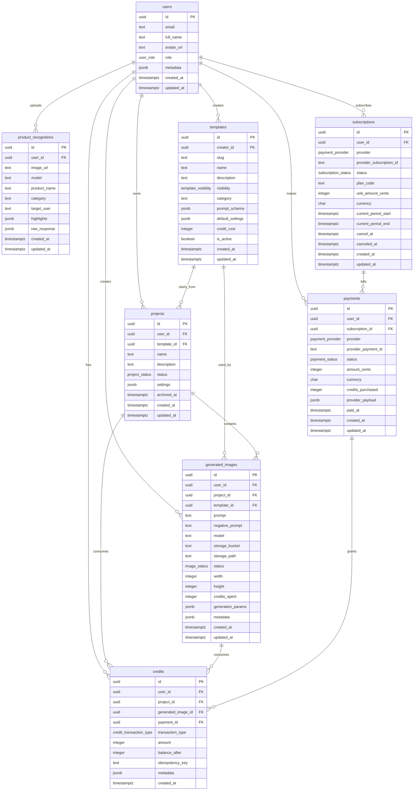

# Supabase Database Design

## ER Diagram

## Production Notes

- `public.users.id` references `auth.users.id` so Supabase Auth remains the identity source of truth.
- Row Level Security is enabled on all application tables.
- `credits` is an immutable-style ledger table with positive grant/refund rows and negative spend/expiration rows. Store the current balance in `balance_after` for auditability; calculate the latest balance from the newest row when needed.
- External payment identifiers use unique indexes scoped by provider to make webhook handling idempotent.
- `idempotency_key` fields are available for payment and credit grant/spend operations.
- Large images should live in Supabase Storage; `generated_images` stores bucket/path and metadata only.
- Uploaded product images are analyzed into `product_recognitions`, storing the product name, category, target user, highlights, and raw OpenAI response for auditability.
- Soft deletion is represented with `archived_at` on projects and status columns on images, payments, and subscriptions.
